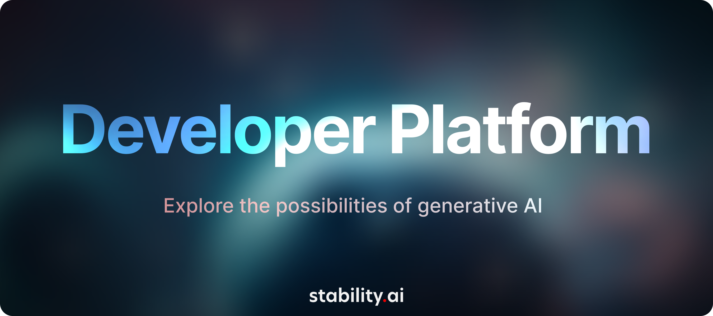
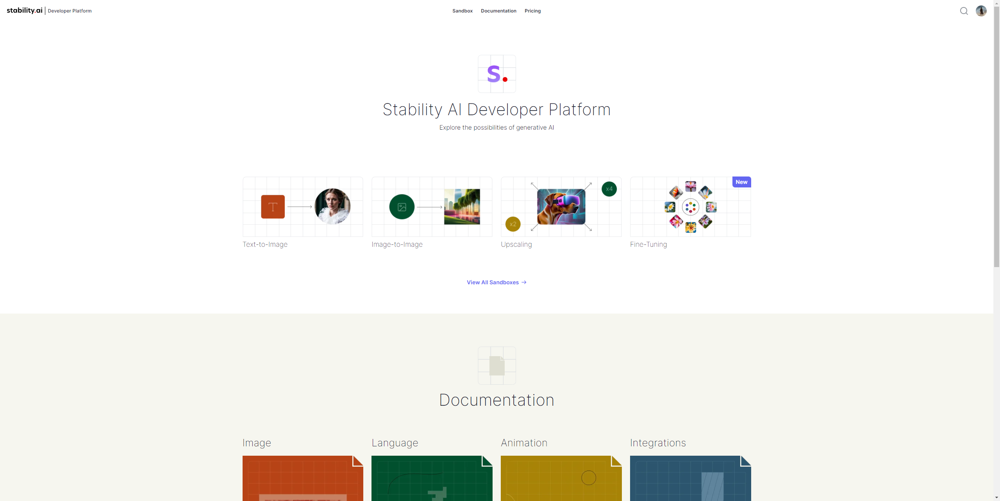
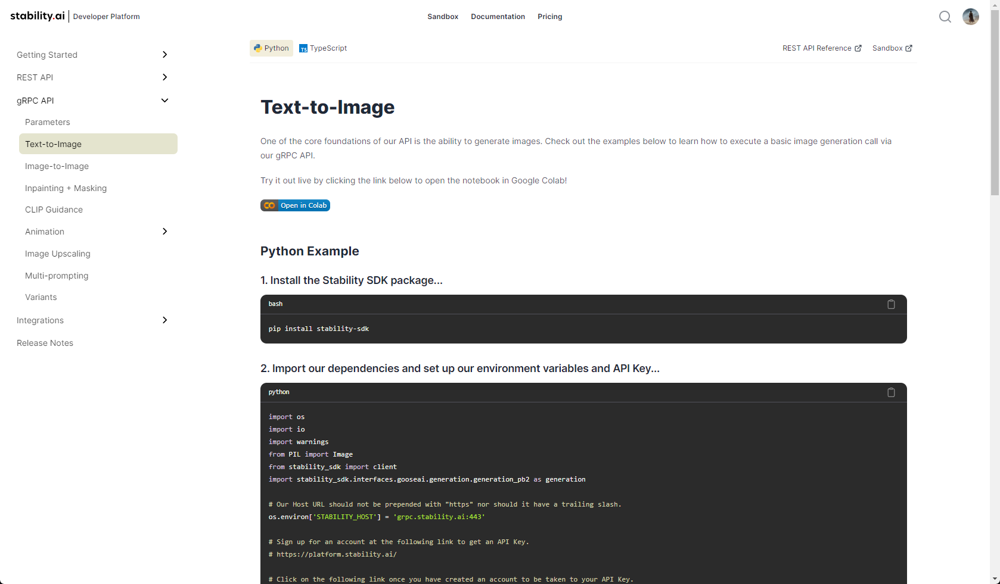

<div align="center" style="display: flex; flex-wrap: wrap; justify-content: center; align-items: center; gap: 1em; margin: 4em 0;">





<h3>👋 Welcome the open-source repository for <a href="https://platform.stability.ai" target="_blank">platform.stability.ai</a>!</h3>
<br />

**🗺 Contents – [🚀 Quick Start](#quick-start) · [ℹ️ About](#about) · [🧑‍💻 Contributing](#contributing)**
<br />

**🔗 Links – <a href="https://discord.com/channels/1002292111942635562/1042896447311454361" target="_blank">🎮 Discord</a> · <a href="https://dreamstudio.ai" target="_blank">🌈 DreamStudio</a> · <a href="https://github.com/Stability-AI/platform/issues">🛟 Bugs & Support</a> · <a href="https://github.com/Stability-AI/platform/discussions">💬 Discussion</a>**
<br />
<br />

</div>

# <a id="quick-start" href="#quick-start">🚀 Quick Start</a>

You'll need to have [Node.js](https://nodejs.org/en/) and [Yarn](https://yarnpkg.com/) installed. Then run the following commands to install dependencies and launch the UI...

```bash
git clone https://github.com/Stability-AI/platform.git
```

```bash
cd platform
```

```bash
yarn
```

```bash
yarn dev
```

_**That's it! 🎉**_

The UI will be running at [localhost:3000](http://localhost:3000) by default.

# <a id="about" href="#about">About</a>

[platform.stability.ai](https://platform.stability.ai) is the home of [Stability AI's](https://stability.ai) developer documentation, code sandboxes, and account management tools.

This repository houses the source code for the UI and SDKs which power the platform.

# <a id="contributing" href="#contributing">🧑‍💻 Contributing</a>

<div style="display: flex; justify-content: center; align-items: center; gap: 1em; margin: 0 0 2em 0;">
  
</div>

**_Community contributions are welcome!_**

**Check out [`CONTRIBUTING.md`](./CONTRIBUTING.md) to get started.**

Bug fixes, documentation, general clean-up, new features, etc. are all welcome.

Here are some useful links...

- [Discussion](https://github.com/Stability-AI/platform/discussions)
- [Open Issues](https://github.com/Stability-AI/platform/issues)
- [Open Pull Requests](https://github.com/Stability-AI/platform/pulls)
- [Code of Conduct](./CODE_OF_CONDUCT.md)
